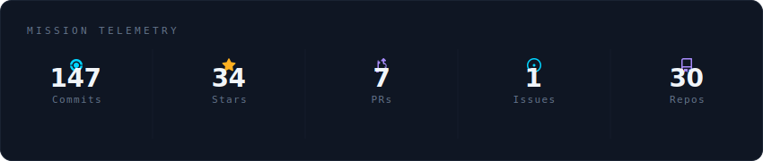

  

 

  

 

  

 

  

 

<strong>More about me</strong>

 

Passionate about leveraging technology to solve real-world problems. 
With a strong foundation in computer science and hands-on experience in machine learning, I thrive on creating innovative solutions that drive impact.

**Currently at** Labic (Laboratório de Internet e Ciência de Dados) — Vitória, ES, Brazil

 

  
  

